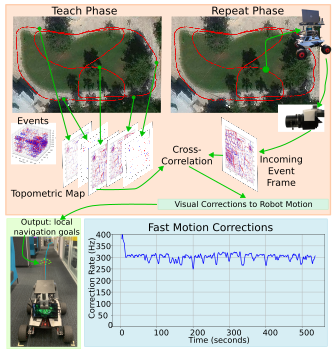
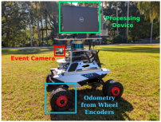
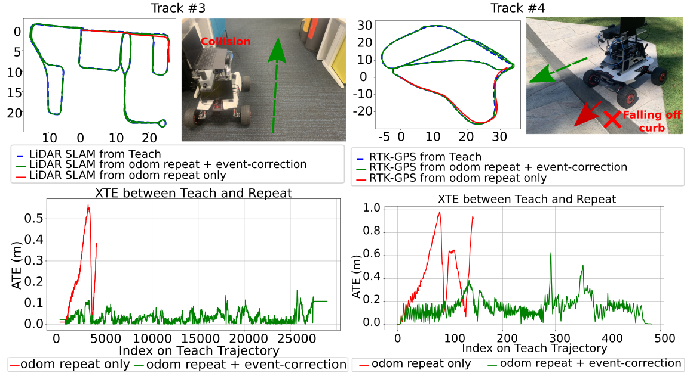

# Event-Based Visual Teach-and-Repeat via Fast Fourier-Domain Cross-Correlation

[](https://pixi.sh)
[](https://robostack.github.io)

[](https://huggingface.co/datasets/gokulbnr/QUT-Event-VTR-Dataset) [](https://arxiv.org/abs/2509.17287)

Welcome to the official repository for the paper [**Event-Based Visual Teach-and-Repeat via Fast Fourier-Domain Cross-Correlation**](https://arxiv.org/abs/2509.17287), to be presented at the 2026 IEEE/RSJ International Conference on Intelligent Robots and Systems (IROS 2026). 

This work demonstrates teach-and-repeat navigation for a mobile robot using an event-based camera as the sole exteroceptive sensor.

<table border="0">
  <tr>
    <!-- Left Column: Main System Diagram -->
    <td width="50%" valign="top">
      
    </td>
    <!-- Right Column: Hardware, GIF, and Tracks Grid -->
    <td width="50%" valign="top">
      <!--  -->
      
      <br><br>
      
    </td>
  </tr>
</table>

---

## 📊 Dataset

Recordings from our reported real-world demonstrations are publicly available in the Hugging Face dataset:
🔗 [**QUT-Event-VTR-Dataset**](https://huggingface.co/datasets/gokulbnr/QUT-Event-VTR-Dataset)

---

## ⚙️ Prerequisites & Dependencies

### Setup via Pixi
We utilize [Pixi](https://pixi.prefix.dev/latest/) environment structures paired with [RoboStack](https://robostack.github.io/index.html):

```bash
# Clone this repository
git clone https://github.com/gokulbnr/event-vtr.git
cd event-vtr

# Install dependencies and build workspace natively
pixi install
```

### Hardware
* **Prophesee EVK4 HD** (or any compatible Metavision event camera).

### Software Dependencies
This project uses **OpenEB** (the open-source core of the Metavision SDK). To support our pipeline, we utilize a custom fork that implements overlapping event-count window binning:
* **Custom OpenEB Fork:** [gokulbnr/openeb (patch-1)](https://github.com/gokulbnr/openeb/tree/patch-1)

```bash
# Clone the repository
git clone git@github.com:gokulbnr/openeb.git
cd openeb
git checkout patch-1
mkdir build && cd build

# 2. Configure the build directory
ccmake ..
```
⚠️ Crucial Configuration Step:
Inside the ccmake TUI, navigate to CMAKE_INSTALL_PREFIX and update it to point directly inside your project's local Pixi environment:

```bash
CMAKE_INSTALL_PREFIX = /path/to/your/event-vtr/.pixi/envs/default
```
This ensures that OpenEB's custom C++ binaries and Python bindings are isolated and natively accessible to the Pixi environment framework.

```bash
# 3. Build and install into the Pixi environment prefix
make -j$(nproc)
sudo make install
```
---

## Cite us at
```
@article{nair2025event,
  title={Event-Based Visual Teach-and-Repeat via Fast Fourier-Domain Cross-Correlation},
  author={Nair, Gokul B and Fontan, Alejandro and Milford, Michael and Fischer, Tobias},
  journal={arXiv preprint arXiv:2509.17287},
  year={2025}
}
```

## License

This project is licensed under the MIT License. See the [LICENSE](LICENSE) file for details.
